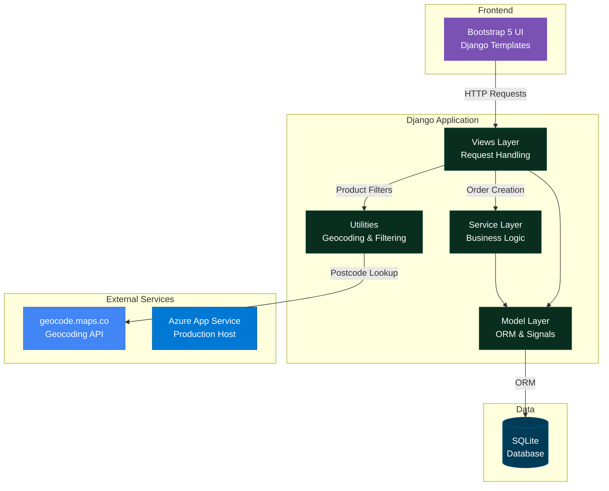
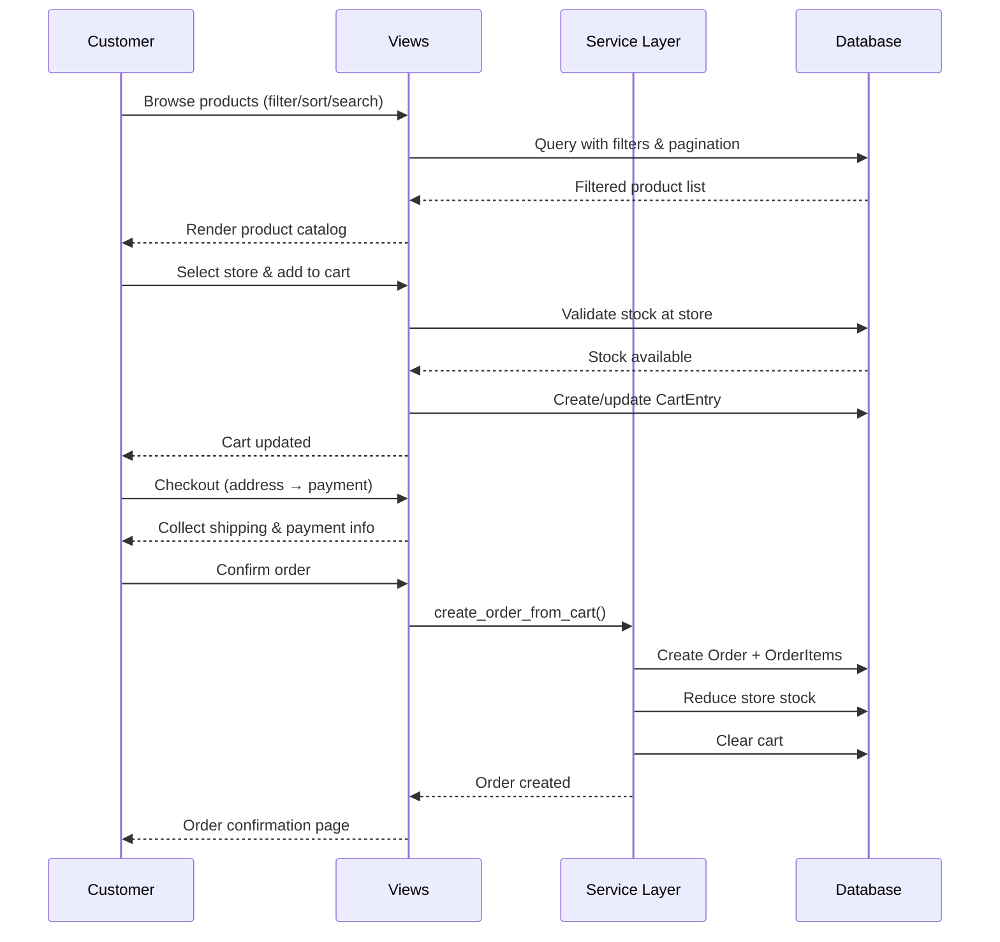
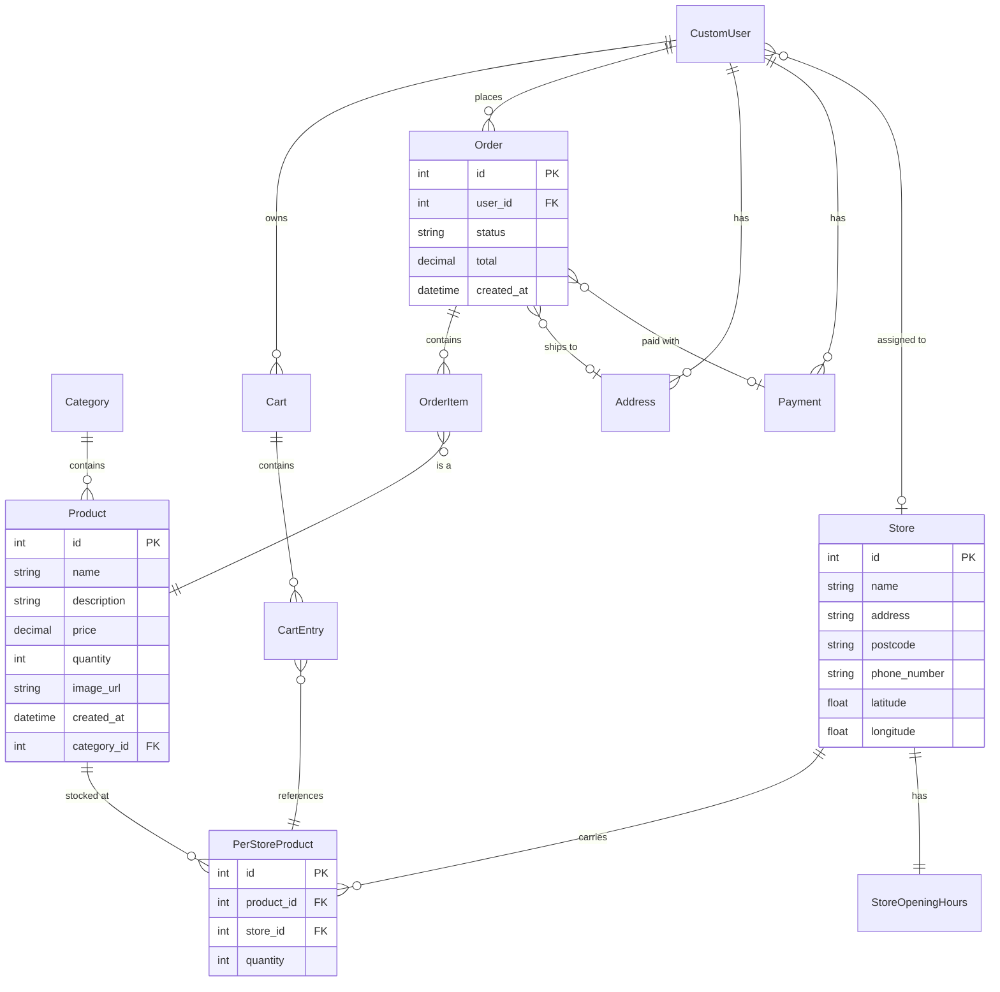
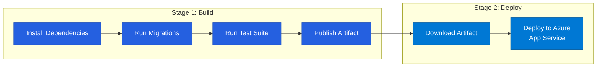

<div align="center">

# **Grocery Store**
## Full-Stack Django E-Commerce Platform

*A production-ready multi-store grocery e-commerce application with real-time geolocation, role-based access control, and a complete shopping workflow.*

### **Technology Stack**

[](https://python.org)
[](https://www.djangoproject.com)
[](https://www.sqlite.org)
[](https://getbootstrap.com)

[](https://azure.microsoft.com/en-us/products/devops/pipelines)
[](https://azure.microsoft.com/en-us/products/app-service)
[](https://gunicorn.org)

</div>

---

## Overview

A Django-based e-commerce platform that models real-world grocery retail with **multi-store inventory management**, where each store maintains independent stock levels for every product. Customers can browse products, find their nearest store via geolocation, add items to a store-scoped cart, and complete a full checkout flow with address and payment collection.

The application features a **custom admin dashboard** for staff to manage users and orders, a **role-based access system** that restricts inventory visibility by store assignment, and a **CI/CD pipeline** deploying to Azure App Service.

---

## Features

### **Shopping Experience**
- **Advanced Product Filtering** — keyword search, category dropdown, price range, in-stock filter with 6 sort modes and configurable pagination (12–60 items/page)
- **Filter Persistence** — filters saved to session and restored on revisit, with removable filter chips
- **Store-Aware Cart** — cart is scoped to a selected store; changing stores clears the cart to prevent cross-store ordering
- **Two-Step Checkout** — address collection followed by payment entry, with order confirmation
- **Per-Store Stock Display** — product detail pages show availability at each store location

### **Store Locator & Geolocation**
- **Find My Closest Store** — enter a postcode to find the nearest store using the Haversine formula
- **Automatic Geocoding** — store coordinates are auto-populated via a Django `pre_save` signal when a postcode is set
- **Google Maps Integration** — store addresses link directly to Google Maps

### **User Management**
- **Custom User Model** — extends Django's `AbstractUser` with store association for staff
- **Profile Dashboard** — view active/past orders, manage payment methods, edit profile
- **Secure Auth** — registration with email uniqueness validation, alphabetic-only name enforcement, session-preserving password changes

### **Admin & Staff Tools**
- **Custom Admin Dashboard** — staff-only interface for user management (activate/deactivate, grant/revoke staff), order management (filter by user, update status), and account creation with role selection
- **Role-Based Inventory** — staff see only products for their assigned store in Django admin; superusers see all
- **Order Lifecycle** — Active → Completed / Cancelled with automatic stock adjustment on placement

---

## System Architecture



### **Shopping Flow**



---

## Database Schema



---

## Quick Start

### **Prerequisites**
```bash
python --version  # Python 3.10+
```

### **Setup**
```bash
# Clone the repository
git clone https://github.com/Brycekoh/grocery-store.git
cd grocery-store

# Create virtual environment
python -m venv venv
source venv/bin/activate  # On Windows: venv\Scripts\activate

# Install dependencies
pip install -r requirements.txt
```

### **Database**
```bash
python manage.py makemigrations
python manage.py migrate
```

### **Seed Sample Data**
```bash
python manage.py seed
```
> Populates the database with 8 categories, 24 products, 3 stores (with opening hours), and randomized inventory across all stores. Use `--clear` to reset before seeding.

### **Create Admin User**
```bash
python manage.py createsuperuser
```

### **Run**
```bash
python manage.py runserver
```

### **Access**
- **Main Site:** http://127.0.0.1:8000/
- **Admin Dashboard:** http://127.0.0.1:8000/admin-dashboard/ (staff only)
- **Django Admin:** http://127.0.0.1:8000/admin/

### **Run Tests**
```bash
python manage.py test
```

---

## API Routes

| Method | Endpoint | Description | Auth |
|--------|----------|-------------|------|
| `GET` | `/` | Product catalog (home) | No |
| `GET` | `/products` | Product listing with filters | No |
| `GET` | `/product/<id>` | Product detail with store stock | No |
| `POST` | `/product/<id>/select_store` | Set active store for product | Yes |
| `GET` | `/stores` | Store directory with geolocation | No |
| `GET/POST` | `/cart` | View/update cart | Yes |
| `POST` | `/add_cart` | Add item to cart | Yes |
| `GET/POST` | `/checkout_address` | Shipping address step | Yes |
| `GET/POST` | `/checkout_payment` | Payment step | Yes |
| `GET` | `/confirm` | Order confirmation | No |
| `GET` | `/order/<id>` | Order detail | Yes |
| `GET/POST` | `/signup/` | User registration | No |
| `GET` | `/profile/` | User profile dashboard | Yes |
| `GET/POST` | `/profile/edit/` | Edit profile | Yes |
| `POST` | `/profile/payment/add/` | Add payment method | Yes |
| `POST` | `/profile/payment/edit/` | Edit payment method | Yes |
| `POST` | `/profile/payment/remove/` | Remove payment method | Yes |
| `GET` | `/admin-dashboard/` | Staff admin dashboard | Staff |

---

## CI/CD Pipeline

The project uses **Azure Pipelines** with a two-stage deployment:



---

## Testing

15 unit and integration tests covering:

| Test Suite | Coverage |
|------------|----------|
| `test_cart.py` | Cart quantity validation, add/remove items, stock limit enforcement |
| `test_forms.py` | User registration form validation (email uniqueness, name format) |
| `test_list_of_stores.py` | Geolocation closest-store calculation with mocked geocoding |
| `test_order_creation.py` | End-to-end order creation from cart |
| `test_product_view.py` | Product filtering, sorting, pagination, search |

---

## License

MIT License — See [LICENSE](LICENSE) for details.
